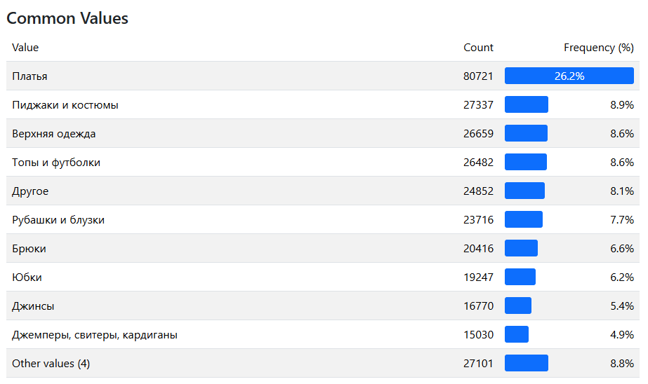
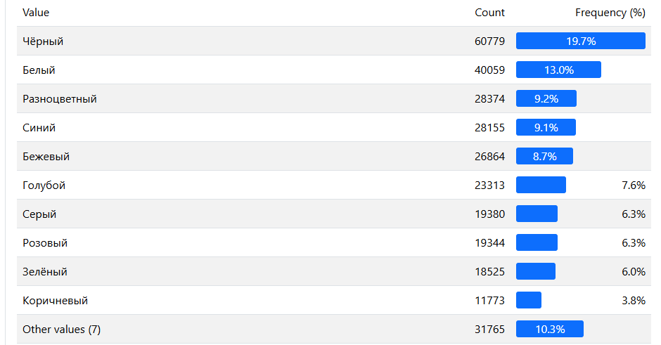
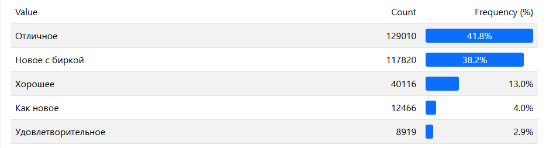

# Отчет EDA

### Данные получены от @Roman Budylin

## items.csv

items.csv - файл с данынми по айтемам (объявлениям)

308331 объявление из категории "Женская одежда", стартовавшие с '2025-06-01' по '2025-06-05'.

item_id - внутренний айди айтема

external_id - внешний айди айтема, то же что item

StartTime - время старта объявления

param2 - парам2 совпадает с "предмет одежды"

Microcat_id - служебное поле, не нужно

sostoyanie - состояние (новое / бу и т.д)

predmet_odezhdy - предмет одежды

cvet - цвет

brand - бренд

title - название объявления

description - описание объявления

### param2/predmet_odezhdy

Самая частая категория "Платья" 26% от всей выборки

### cvet

Преобладает чёрный и белый цвет

### sostoyanie

В состоянии товара в основном указывают отличное или новое с биркой, вероятно это карточки от магазинов на авито

### title

Средняя длина названия 79 букв, самое длинное 100. 

### description

152000 уникальных описаний, самое популяное "женское платье" встретилось 5698 раз.

## Изображения

1339085 изображения, 305456 титульных, 1033629 дополнительных

На 20 случайно просмотренных титульных изображения крупным планом видно предмет одежды. 